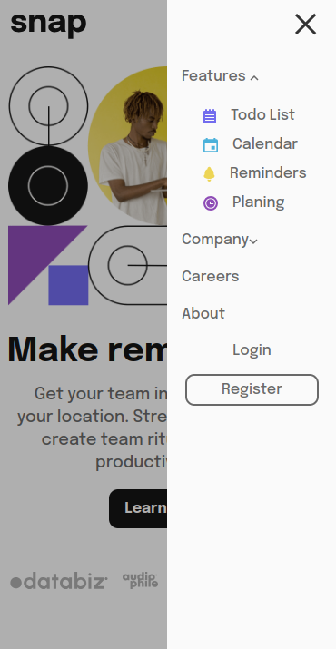

# Frontend Mentor - Intro section with dropdown navigation solution

This is a solution to the
[Intro section with dropdown navigation challenge on Frontend Mentor](https://www.frontendmentor.io/challenges/intro-section-with-dropdown-navigation-ryaPetHE5).

Check all exercises here
https://github.com/ahmad-kashkoush/FrontEnd-Mentors-exercices

## Table of contents

- [Overview](#overview)
  - [The challenge](#the-challenge)
  - [Screenshot](#screenshot)
  - [Links](#links)
- [My process](#my-process)
  - [Built with](#built-with)
  - [What I learned](#what-i-learned)

## Overview

### The challenge

Users should be able to:

- ✅ View the relevant dropdown menus on desktop and mobile when interacting
  with the navigation links
- ✅View the optimal layout for the content depending on their device's screen
  size
- ✅See hover states for all interactive elements on the page

### Screenshot

 
 

### Links

- Solution URL: https://github.com/ahmad-kashkoush/intro-section-with-dropdown
- Live Site URL: https://intro-section-with-dropdown-zeta.vercel.app/

## My process

### Built with

- Semantic HTML5 markup
- CSS custom properties
- Flexbox
- Mobile-first workflow

### What I learned

- Creating `A scalable hamburger menu🍔` with sidebar. Checkout
  [the following commit](https://github.com/ahmad-kashkoush/intro-section-with-dropdown/commit/2ada770b19dc7205257da271b0b24cca05895d27)
- `has` property 🚀 in css checkout the following
  [mdn link](https://developer.mozilla.org/en-US/docs/Web/CSS/:has)
- freshed up my mind about` standard width of containers` 💠
- It is ok for sometimes to not use `mobile-first` 📴, but It is really powerful
  in most cases
